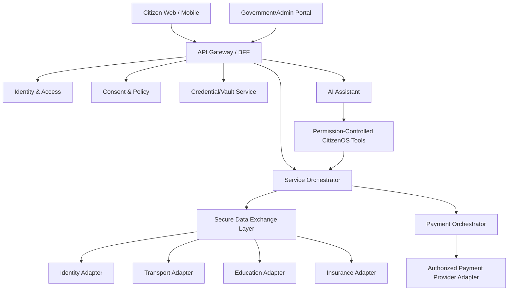

# CitizenOS Nepal — Product Requirements Document (PRD) v0.1

**Status:** Draft / Discovery  
**Product Type:** Digital Public Infrastructure reference architecture and prototype  
**Geographic Context:** Nepal  
**Version:** 0.1

## 1. Executive Summary

CitizenOS Nepal is a proposed citizen-centered Digital Public Infrastructure (DPI) platform that provides a unified, secure gateway to government and authorized services. It is not intended to replace the databases of ministries, departments, municipalities, universities, hospitals, insurers, or payment providers. Instead, CitizenOS acts as a trusted interoperability, consent, workflow, credential, payment, and assistance layer between citizens and participating institutions.

The project addresses fragmentation: citizens often interact with separate portals, offices, identity checks, payment processes, and document requirements. CitizenOS proposes a common digital identity experience, verified digital credentials, consent-based data exchange, service orchestration, payment integration, notifications, and an AI Citizen Assistant.

The prototype will use synthetic citizens and mock/sandbox agency integrations unless an official integration is explicitly available and authorized.

## 2. Problem Statement

Nepal's public digital ecosystem contains useful digital systems, but the citizen experience remains fragmented. A person may need different portals, credentials, documents, payment channels, and physical visits for related administrative tasks. Repeated submission and verification of the same information increases friction and creates opportunities for errors.

CitizenOS explores whether a common trust and interoperability layer can make these services feel like one coherent ecosystem without creating one uncontrolled national database.

## 3. Product Vision

**One trusted digital gateway through which a citizen can securely discover, understand, verify, pay for, and complete connected public-service workflows.**

## 4. Product Principles

1. **Federated by default:** authoritative agencies retain ownership of official records.
2. **Privacy by design:** access must be purpose-limited, auditable, and consent-based where legally appropriate.
3. **Security before convenience:** high-risk actions require stronger authentication and authorization.
4. **Citizen-centered:** organize around life events and user goals rather than government organizational charts.
5. **Interoperability before duplication:** exchange verified data through standardized interfaces rather than copying entire databases.
6. **Human oversight:** AI must not become the final authority for high-impact legal or administrative decisions.
7. **Accessible and multilingual:** design for varying devices, connectivity, literacy, language, and accessibility needs.
8. **Transparent:** users should understand who accessed their data, for what purpose, and what action occurred.

## 5. Goals

- Demonstrate a credible architecture for interoperable digital public services in Nepal.
- Provide a unified citizen authentication and service experience.
- Support verifiable digital credentials and documents.
- Demonstrate end-to-end government payment and renewal workflows.
- Provide transparent consent and access history.
- Use AI to explain, discover, and navigate services safely.
- Demonstrate how education credentials and skills could support career and opportunity discovery.
- Reduce repeated data entry in the prototype workflows.

## 6. Explicit Non-Goals for v0.1

CitizenOS v0.1 will **not**:

- replace Nepal's National ID infrastructure;
- create a production biometric identity database;
- claim access to government databases that the project does not actually have;
- store every government record in one central database;
- implement electronic voting;
- make autonomous legal, licensing, welfare, healthcare, policing, or eligibility decisions;
- implement a citizen/social scoring system;
- provide unrestricted cross-agency access to citizen data;
- attempt nationwide production deployment as part of the initial prototype.

## 7. Primary Users

### Citizen
Needs one understandable place to access credentials, services, payments, reminders, permissions, and assistance.

### Government Officer
Needs authenticated workflows, appropriate record access, approvals, auditability, and clear separation of duties.

### Agency Administrator
Needs service configuration, role management, integration monitoring, reporting, and audit tools.

### Authorized Institution
Examples include educational institutions, insurers, banks, and other approved service providers. They should receive only the data or verification required for an authorized purpose.

### Developer / Integration Team
Needs documented APIs, sandbox environments, credentials, schemas, webhooks, test data, and integration guidance.

## 8. MVP Scope

The MVP should prove the architecture with five connected experiences rather than superficially implementing every government service.

### MVP-01 — Identity & Authentication

- Prototype digital identity account
- MFA/passkey-ready authentication design
- Device/session management
- Account recovery flow
- Step-up authentication for sensitive operations
- Consent and authorization interaction

### MVP-02 — Verified Digital Vault

- View verified credentials
- Credential issuer and verification status
- Issue/expiry information
- QR-based verification prototype
- Selective sharing/verification
- Access history
- Revocation/expired state

### MVP-03 — Transport Renewal Journey

Demonstrate a vehicle or driving-licence renewal workflow involving:

1. authenticated citizen;
2. retrieval from a mock transport adapter;
3. eligibility/rule checks;
4. insurance verification through a mock adapter;
5. fee calculation;
6. payment initiation;
7. payment confirmation;
8. government-service confirmation;
9. receipt and updated credential/status.

The workflow must handle payment-success/service-failure and retry/reconciliation cases.

### MVP-04 — Education Credential Verification

- Display issuer-verified academic credentials
- Verify credential authenticity
- Allow purpose-limited sharing
- Provide a machine-readable skills/qualification representation where appropriate

### MVP-05 — AI Citizen Assistant

The assistant may:

- explain public-service procedures;
- search the CitizenOS service catalogue;
- explain required documents;
- surface upcoming expirations and tasks;
- navigate the user to workflows;
- summarize the user's own authorized records;
- recommend potentially relevant benefits, opportunities, jobs, or training based on data the user has permitted for that purpose.

The assistant must not independently approve/reject government applications or silently access unrelated sensitive information.

## 9. Functional Requirements

### Identity

- **FR-ID-001:** The system shall authenticate prototype citizens using a secure identity service.
- **FR-ID-002:** The system shall support multi-factor authentication architecture.
- **FR-ID-003:** Sensitive operations shall support step-up authentication.
- **FR-ID-004:** Users shall be able to review active sessions/devices.
- **FR-ID-005:** Authentication events shall generate security audit events.

### Consent & Authorization

- **FR-CONSENT-001:** A citizen shall be shown the requesting party, requested attributes, purpose, and duration before consent where consent is the appropriate legal basis.
- **FR-CONSENT-002:** The platform shall record a consent receipt.
- **FR-CONSENT-003:** Citizens shall be able to review historical consent and access activity.
- **FR-CONSENT-004:** Revocation shall stop future consent-dependent access; it shall not rewrite legally required historical records.

### Digital Vault

- **FR-VAULT-001:** Users shall view credentials grouped by domain.
- **FR-VAULT-002:** Each credential shall identify its issuer and status.
- **FR-VAULT-003:** The system shall distinguish verified credentials from user-supplied attachments.
- **FR-VAULT-004:** The system shall support credential verification without exposing unnecessary attributes.
- **FR-VAULT-005:** Expired or revoked credentials shall be clearly represented.

### Payments

- **FR-PAY-001:** Users shall receive an itemized fee before payment.
- **FR-PAY-002:** Payment initiation and government-service completion shall be separate state transitions.
- **FR-PAY-003:** The system shall use idempotency controls to reduce duplicate payment processing.
- **FR-PAY-004:** Confirmed transactions shall produce a receipt/reference.
- **FR-PAY-005:** Failed, pending, refunded, and reconciliation-required states shall be supported.

### Notifications

- **FR-NOTIFY-001:** Users shall receive configurable expiry reminders.
- **FR-NOTIFY-002:** Security-critical notifications shall be clearly separated from promotional/recommendation notifications.
- **FR-NOTIFY-003:** Every actionable notification shall deep-link to the relevant workflow when possible.

### AI

- **FR-AI-001:** The assistant shall identify itself as an assistant rather than a government decision-maker.
- **FR-AI-002:** Tool/data access shall follow the user's authorization and backend policy checks.
- **FR-AI-003:** High-impact actions shall require explicit confirmation and/or human/agency approval.
- **FR-AI-004:** AI-generated procedural answers should reference an authoritative service knowledge source in the production design.
- **FR-AI-005:** AI actions shall generate traceable audit events where they interact with citizen services.
- **FR-AI-006:** Career recommendations shall be recommendations, not employment eligibility decisions.

## 10. Non-Functional Requirements

### Security

- Encrypt sensitive data in transit and at rest.
- Apply least privilege and separation of duties.
- Centralize security telemetry while minimizing unnecessary sensitive content in logs.
- Protect secrets and cryptographic keys outside application source code.
- Design for regular security review, penetration testing, dependency scanning, and incident response.

### Privacy

- Data minimization.
- Purpose limitation.
- Explicit retention policies.
- Access transparency.
- Sensitive-domain isolation where appropriate.
- No secondary AI training on citizen data by default.

### Reliability

Critical workflows must be designed for retries, idempotency, partial failures, and reconciliation. Payment completion must never be assumed to mean government-service completion.

### Accessibility

Target WCAG 2.2 AA for citizen-facing interfaces. Support keyboard navigation, screen-reader semantics, sufficient contrast, reduced motion, scalable text, and understandable error messages.

### Localization

Architecture must support Nepali and English initially and allow additional languages without redesigning core components.

### Performance

Define measurable service-level objectives during architecture/performance testing rather than inventing production guarantees before infrastructure is known.

## 11. High-Level Architecture

## 12. Data Ownership Model

CitizenOS should primarily store what it needs to operate the platform: account/security metadata, consent receipts, workflow state, credential references or appropriately designed credentials, transaction references, notification state, configuration, and audit events.

Authoritative domain records should remain with their responsible systems whenever practical. The platform should not casually replicate complete health, tax, land, education, or identity datasets.

## 13. Security Threats to Address

The threat model must include at minimum:

- stolen or compromised citizen devices;
- credential phishing/account takeover;
- compromised government officer accounts;
- insider misuse;
- malicious or compromised agency integrations;
- forged credentials/QR codes;
- API abuse and broken authorization;
- replay attacks;
- payment fraud and duplicate callbacks;
- sensitive-data leakage through logs;
- AI prompt injection and tool misuse;
- excessive AI permissions;
- denial of service;
- dependency/supply-chain compromise;
- backup or disaster-recovery failure.

## 14. Success Metrics for Prototype

Prototype evaluation should measure outcomes rather than vanity metrics.

- Completion rate for selected service journeys
- Median time to complete a renewal prototype
- Number of repeated fields eliminated through verified data exchange
- Payment reconciliation accuracy in test scenarios
- Credential verification success rate
- Accessibility test pass rate
- Security test findings by severity
- AI grounded-answer accuracy on the approved service knowledge base
- AI unsafe/unauthorized tool-action rate (target: zero in evaluation suite)
- User comprehension of consent requests

## 15. Key Risks

### Institutional integration
The biggest real-world risk is not frontend technology; it is coordination, authority, standards, data quality, and interoperability across institutions.

### Privacy concentration
A unified interface can accidentally become a surveillance or data-concentration mechanism. Federated ownership and strict authorization are therefore architectural requirements.

### AI overreach
An AI that appears authoritative can mislead citizens. The product must clearly separate assistance from legally authoritative decisions.

### Digital exclusion
A smartphone-only design would exclude some citizens. Future production planning must include assisted service channels and realistic low-connectivity strategies.

### Scope explosion
Attempting to implement every government service in the MVP would create a shallow demo. New domains should be added only after the common platform capabilities are proven.

## 16. Assumptions

- Government production APIs are not assumed to be available to the prototype.
- Synthetic test citizens and mock agency adapters will be used.
- Payment integrations will use sandbox/mock modes unless authorized credentials are available.
- Legal and regulatory requirements require continuing review; this PRD is not legal advice.
- Production biometric processing is outside the initial prototype scope.

## 17. MVP Acceptance Criteria

The MVP is successful when a synthetic citizen can:

1. authenticate securely;
2. view verified prototype credentials;
3. understand and approve a scoped data-sharing request;
4. complete a simulated transport renewal involving insurance and payment;
5. receive a receipt and updated service status;
6. verify/share an education credential;
7. ask the AI assistant about supported services and receive grounded guidance;
8. see an audit/access history for important actions.

The system must also demonstrate failed-payment, duplicate-callback, expired credential, denied-consent, unauthorized-access, and AI-tool-denial scenarios.

## 18. Delivery Sequence

1. Research baseline
2. PRD validation
3. Architecture Decision Records
4. Threat model and privacy model
5. Domain/data model
6. API contracts
7. UX flows and design system
8. Mock agency services
9. Citizen-facing prototype
10. AI assistant with restricted tools
11. Security/accessibility/evaluation testing
12. Pilot demonstration

## 19. Open Questions

- What official interoperability standards and APIs are currently available to participating Nepal government systems?
- What legal basis should govern each category of cross-agency data exchange?
- Which institution would act as platform operator/trust authority in a real deployment?
- Which credentials should be references versus portable signed credentials?
- Which payment architecture best supports government reconciliation and refunds?
- What assisted/offline service model best fits rural and low-connectivity contexts?
- Which government workflow is the strongest candidate for a real institutional pilot?

## 20. Definition of Done for PRD v1.0

PRD v1.0 should not be declared complete until Nepal-specific research, stakeholder assumptions, architecture decisions, security/privacy review, service blueprints, data model, API contracts, UX flows, measurable acceptance criteria, and MVP feasibility have been reviewed for contradictions.
