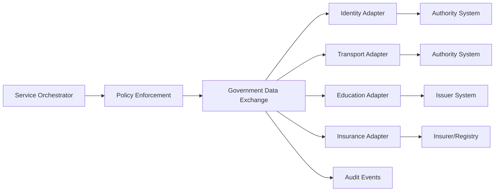

# CitizenOS Nepal — Interoperability & Government Data Exchange

## 1. Purpose
CitizenOS must connect heterogeneous public and authorized private systems without assuming they use the same technology, schema, uptime model, or authentication mechanism. Interoperability is therefore implemented through explicit contracts and adapters rather than direct database access.

## 2. Non-Negotiable Rules
- No cross-agency direct database access.
- No undocumented production integration claims.
- Every external request has actor, purpose, correlation ID and authorization context.
- Data returned is minimized to the attributes needed for the workflow.
- External failures become explicit workflow states.
- Prototype integrations are named Mock/Sandbox adapters.

## 3. Logical Architecture


## 4. Canonical Exchange Envelope
Each request should carry a normalized envelope independent of the external agency protocol:

```json
{
  "request_id": "uuid",
  "correlation_id": "uuid",
  "actor": {"type": "citizen|officer|service", "id": "opaque-id"},
  "purpose": "transport.renewal.verify_insurance",
  "resource": "insurance.status",
  "consent_reference": "optional-consent-id",
  "requested_attributes": ["coverage_status", "valid_until"],
  "timestamp": "RFC3339"
}
```

Sensitive national identifiers should not become universal internal identifiers.

## 5. Adapter Contract
Every adapter should implement equivalent capabilities for health checks, schema/version reporting, request validation, timeout handling, authorization propagation, normalized errors and response provenance.

Example conceptual interface:

```text
verify(subject, attributes, purpose, context) -> VerificationResult
fetch(reference, attributes, purpose, context) -> DataResult
submit(command, purpose, context, idempotencyKey) -> CommandResult
status(externalReference) -> ExternalStatus
```

Not every agency supports every operation.

## 6. Response Provenance
Normalized responses should preserve:
- source/issuer identifier
- external reference
- source timestamp
- schema/version
- verification status
- expiry/freshness where applicable

CitizenOS must not transform a weak/unverified source into a `verified` credential merely because it passed through the platform.

## 7. Error Model
Normalize external failures into stable categories:
- `AUTHENTICATION_FAILED`
- `AUTHORIZATION_DENIED`
- `CONSENT_REQUIRED`
- `NOT_FOUND`
- `VALIDATION_FAILED`
- `DEPENDENCY_UNAVAILABLE`
- `DEPENDENCY_TIMEOUT`
- `RATE_LIMITED`
- `CONFLICT`
- `PENDING_EXTERNAL_PROCESSING`
- `UNKNOWN_EXTERNAL_ERROR`

Do not expose raw upstream stack traces or secrets to clients.

## 8. Reliability
Reads may use carefully bounded retries. Mutations require idempotency. Circuit breakers isolate failing dependencies. Reconciliation jobs resolve ambiguous external outcomes. Caching is permitted only when policy, sensitivity, freshness and revocation requirements allow it.

## 9. Versioning
CitizenOS owns its canonical internal contracts. Adapters translate agency-specific versions. Breaking canonical changes require explicit versioning and migration planning.

## 10. Production Governance Requirements
A real deployment would require institutional agreements defining authority, permitted purposes, data categories, retention, security requirements, incident handling, SLA expectations, schema ownership and change management. Code alone cannot solve interoperability governance.
