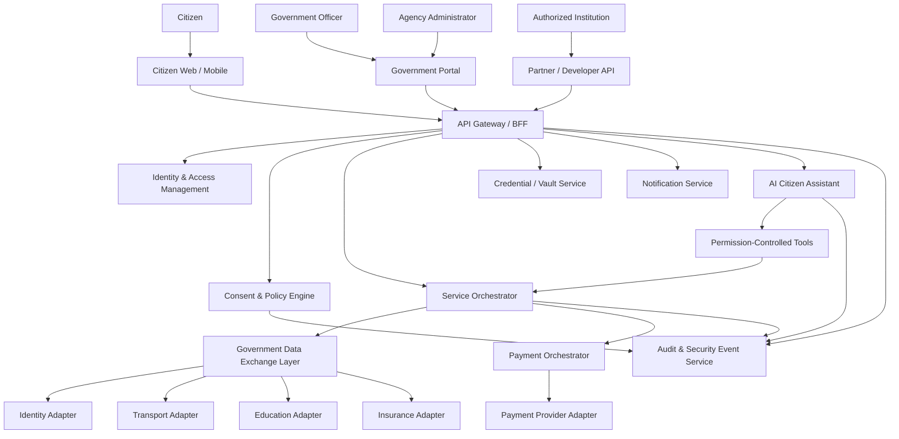
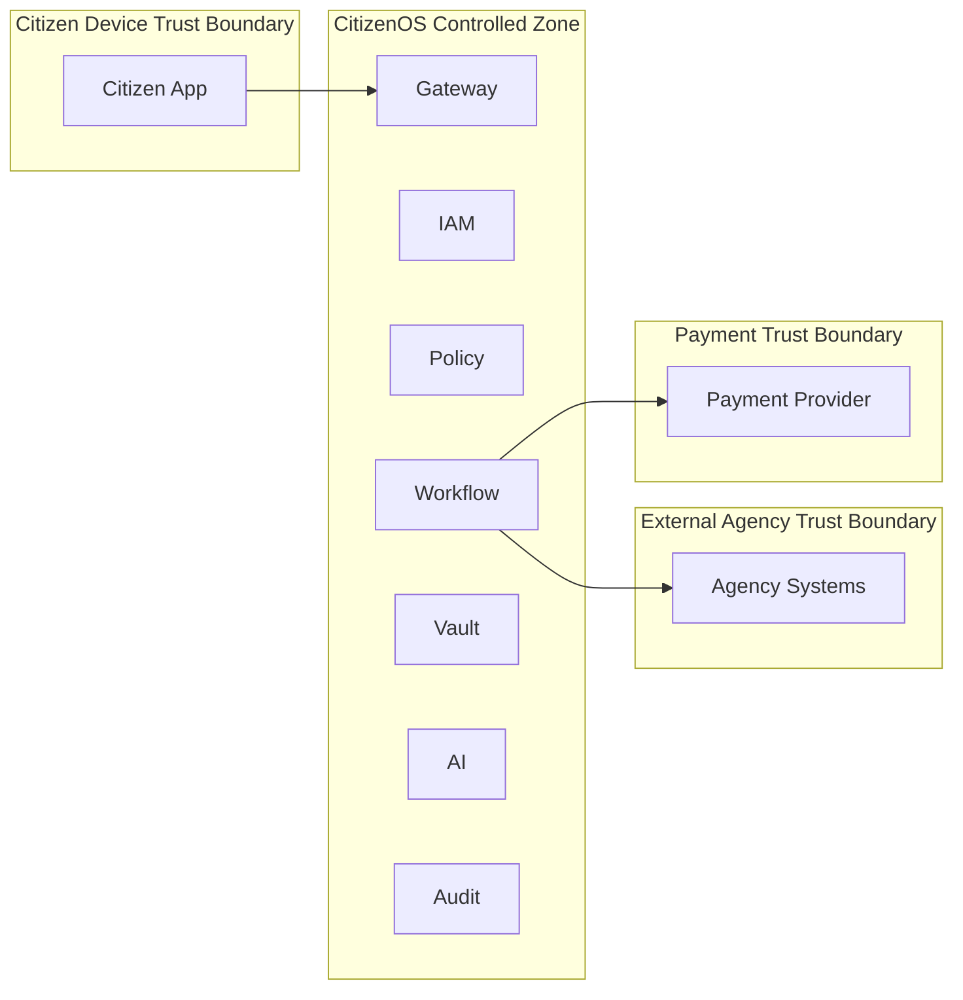

# CitizenOS Nepal — System Architecture Overview

**Status:** Draft v0.1  
**Scope:** Reference architecture for the MVP and future DPI expansion

## 1. Architectural Objective

CitizenOS Nepal is designed as a federated digital public infrastructure layer rather than a single national database. The platform coordinates identity, consent, data exchange, payments, verified credentials, notifications, and AI-assisted service workflows while authoritative agencies continue to own their domain records.

## 2. Core Architectural Principles

1. Federated data ownership
2. Zero-trust service-to-service communication
3. Least-privilege access
4. Consent and policy enforcement at every sensitive boundary
5. Strong separation between citizen-facing UX and authoritative agency systems
6. Event and transaction traceability
7. Failure-aware orchestration
8. AI treated as a constrained client of approved tools, not as a privileged backend
9. Mock/sandbox adapters for unavailable institutional APIs
10. Replaceable adapters so prototype integrations can later be swapped for authorized production integrations

## 3. High-Level Context

## 4. Major Components

### 4.1 Citizen Applications
Web and mobile experiences for identity, documents, services, payments, notifications, permissions, and AI assistance.

### 4.2 Government/Admin Portal
Role-restricted interface for authorized officers and administrators. It must not bypass backend authorization or policy checks.

### 4.3 API Gateway / Backend-for-Frontend
Provides routing, rate limiting, token validation, request correlation, API versioning, and interface adaptation. Business authorization remains in domain services and the policy layer.

### 4.4 Identity & Access Management
Responsible for authentication, sessions, step-up authentication, service identities, role/attribute evaluation inputs, and identity assurance metadata.

### 4.5 Consent & Policy Engine
Evaluates whether a requested action is allowed based on identity, role, purpose, legal basis, citizen consent where applicable, data sensitivity, service policy, and risk context.

### 4.6 Service Orchestrator
Coordinates multi-step workflows across agencies, payments, credentials, and notifications. It is responsible for durable workflow state and compensation/reconciliation logic.

### 4.7 Government Data Exchange Layer
A secure interoperability layer through which approved adapters access agency systems. It standardizes authentication, request tracing, schemas, timeouts, retries, and policy enforcement.

### 4.8 Credential / Vault Service
Stores credential metadata, status, references, and portable signed credentials where appropriate. It distinguishes authoritative verified credentials from ordinary user attachments.

### 4.9 Payment Orchestrator
Separates government obligations from payment-provider transactions. It handles payment intent, callback verification, reconciliation, refunds, duplicate events, and service-completion state.

### 4.10 AI Citizen Assistant
Provides grounded explanations, discovery, navigation, and constrained workflow assistance. It receives no unrestricted database access. All backend actions occur through permission-controlled tools.

### 4.11 Audit & Security Event Service
Captures security-relevant and legally significant events with strong integrity controls, correlation IDs, retention policy, and access restrictions.

## 5. Trust Boundaries

Every crossing of these boundaries requires authentication, authorization, input validation, logging, timeout handling, and explicit data minimization.

## 6. Data Ownership

| Data | Authoritative Owner | CitizenOS Role |
|---|---|---|
| National identity attributes | Authorized identity authority | Verification/reference only |
| Driving licence/vehicle record | Transport authority | Workflow/reference/credential representation |
| Academic credential | Issuing institution/authorized authority | Verification and user-facing credential representation |
| Insurance policy status | Authorized insurer/registry | Verification/reference |
| Payment settlement | Regulated payment provider/banking system | Transaction orchestration/reference |
| Consent receipt | CitizenOS | Authoritative for CitizenOS consent event |
| Workflow state | CitizenOS | Authoritative |
| Audit/security event | CitizenOS | Authoritative |
| AI conversation state | CitizenOS, minimized | Operational only; subject to retention policy |

## 7. Workflow State Model

Long-running government transactions must not be modeled as a single HTTP request. A generic service workflow may include:

`DRAFT → VALIDATING → AWAITING_CONSENT → ELIGIBILITY_CHECK → AWAITING_PAYMENT → PAYMENT_CONFIRMED → AGENCY_PROCESSING → COMPLETED`

Failure states may include:

`PAYMENT_PENDING`, `PAYMENT_FAILED`, `RECONCILIATION_REQUIRED`, `AGENCY_UNAVAILABLE`, `MANUAL_REVIEW`, `REJECTED`, `CANCELLED`.

## 8. Integration Strategy

Every external integration uses an adapter contract. Example interfaces:

- `IdentityVerificationAdapter`
- `TransportServiceAdapter`
- `EducationCredentialAdapter`
- `InsuranceVerificationAdapter`
- `PaymentProviderAdapter`

Prototype implementations are explicitly named `Mock*` or `Sandbox*` and must never be presented as real government integrations.

## 9. Availability and Failure Strategy

- Timeouts are mandatory for external calls.
- Retries must use bounded exponential backoff where safe.
- Mutating operations require idempotency keys.
- Payment callbacks must be verified and deduplicated.
- Cross-system workflows use durable state and reconciliation rather than distributed database transactions.
- Circuit breakers should isolate unstable external systems.
- User interfaces must display pending states instead of pretending a failed dependency completed successfully.

## 10. Observability

Every request should include a correlation ID. Metrics, structured logs, traces, and security events must distinguish technical diagnostics from sensitive citizen data. Logs must not contain raw secrets, tokens, biometrics, or unnecessary document contents.

## 11. MVP Deployment Shape

The MVP may begin as a modular monolith plus separate AI and mock-integration services if that reduces complexity. Microservices should be introduced only where independent security boundaries, scaling, or ownership justify them. Kubernetes is not required for the first working prototype.

## 12. Architecture Success Criteria

The architecture is acceptable when:

- no service requires unrestricted access to all citizen data;
- every high-risk operation has an explicit authorization path;
- agency ownership is preserved;
- payment and service completion are independent states;
- AI cannot call backend capabilities outside approved tools;
- failure and reconciliation paths exist;
- prototype integrations are clearly distinguishable from real integrations.
