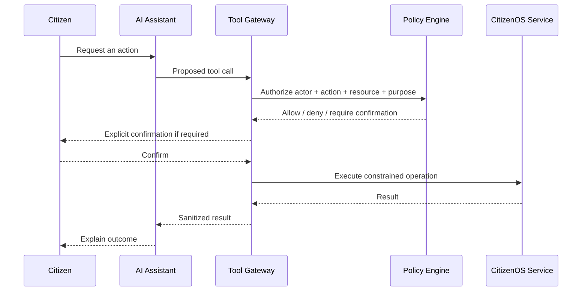

# CitizenOS Nepal — Threat Model v0.1

## 1. Objective

CitizenOS handles identity, credentials, government workflows, payments, and potentially sensitive citizen information. Security therefore defines the architecture rather than being added after development.

This threat model is an initial engineering model, not a completed security certification.

## 2. Protected Assets

- citizen accounts and authentication factors
- identity attributes and identifiers
- verified credentials
- consent and authorization records
- government service applications/workflows
- payment references and receipts
- agency integration credentials
- signing/encryption keys
- audit evidence
- AI tool permissions and policy
- administrative accounts

## 3. Primary Adversaries

- external account attacker
- phishing/credential-stealing attacker
- malicious user attempting another citizen's records
- compromised citizen device
- malicious or compromised government officer
- privileged insider
- compromised partner/agency integration
- fraudulent payment actor
- automated bot/API attacker
- attacker exploiting AI prompt injection/tool invocation
- software supply-chain attacker

## 4. Trust Boundaries

1. Citizen device ↔ CitizenOS edge
2. Government/admin device ↔ CitizenOS edge
3. Public API ↔ internal services
4. CitizenOS ↔ external government agency
5. CitizenOS ↔ payment provider
6. AI model/runtime ↔ CitizenOS tools
7. application services ↔ data stores
8. operational staff ↔ production infrastructure

## 5. Priority Threat Scenarios

| ID | Threat | Impact | Core Controls |
|---|---|---|---|
| T-01 | Account takeover | Critical | MFA/passkeys, rate limiting, session controls, anomaly detection |
| T-02 | Broken object-level authorization | Critical | server-side resource authorization, policy engine, negative tests |
| T-03 | Officer accesses unrelated citizen data | Critical | ABAC/purpose binding, least privilege, audit, supervisory review |
| T-04 | Forged credential/QR | High | cryptographic signatures/status checks, anti-replay/expiry |
| T-05 | Payment callback forgery | Critical | signature verification, server-side confirmation, idempotency |
| T-06 | Payment succeeds but renewal fails | High | durable workflow, reconciliation queue, user-visible pending state |
| T-07 | Sensitive data leaked through logs | High | structured redaction, logging policy, secret scanning |
| T-08 | Compromised agency API | Critical | mTLS/workload identity, schema validation, allowlists, least privilege |
| T-09 | AI prompt injection causes tool misuse | Critical | tool allowlist, policy enforcement outside model, confirmations |
| T-10 | AI hallucinates government requirement | High | authoritative retrieval, source/version metadata, uncertainty handling |
| T-11 | Admin credential compromise | Critical | phishing-resistant MFA, privileged access controls, short sessions |
| T-12 | Database exfiltration | Critical | encryption, segmentation, least privilege, minimized stored data |
| T-13 | Dependency compromise | High | lockfiles, SBOM, scanning, review, provenance controls |
| T-14 | Denial of service | High | rate limits, WAF/edge controls, quotas, circuit breakers |
| T-15 | Recovery flow takeover | Critical | high-assurance recovery, notifications, anti-social-engineering design |

## 6. AI-Specific Security Boundary

The LLM is **not trusted to authorize actions**.

Prompt text, retrieved documents, or external webpages must never be able to grant permissions.

## 7. Payment Security Rules

- Never trust client-side payment success.
- Verify provider callbacks/signatures server-side.
- Use unique transaction and idempotency identifiers.
- Deduplicate callbacks.
- Store minimum payment data required; do not store raw card credentials.
- Separate `payment_status` from `service_status`.
- Reconcile ambiguous/pending transactions.
- Audit refund and manual adjustment operations.

## 8. Credential Verification Rules

QR codes should carry a safe verification reference or signed presentation, not dump sensitive citizen records. Verification must consider issuer trust, signature validity, expiry, revocation/status, audience/purpose where relevant, and replay risk.

## 9. Insider Threat Controls

- no shared officer accounts
- least privilege
- separation of duties
- privileged-action logging
- reason/purpose capture for sensitive access
- periodic access review
- alerts for unusual bulk access
- emergency access must be exceptional and heavily audited

## 10. Security Testing Requirements

Before demonstration release:

- authentication tests
- authorization matrix tests
- IDOR/BOLA tests
- rate-limit tests
- input/schema validation tests
- dependency and secret scanning
- payment replay/duplicate callback tests
- privilege escalation tests
- AI prompt-injection/tool-authorization tests
- audit integrity/coverage tests
- backup/restore exercise

## 11. Security Non-Claims

The prototype must not be described as `government-grade`, `military-grade`, `unhackable`, or production-certified merely because these controls are documented. Those claims require implementation evidence, independent testing, governance, and appropriate certification/authorization.
