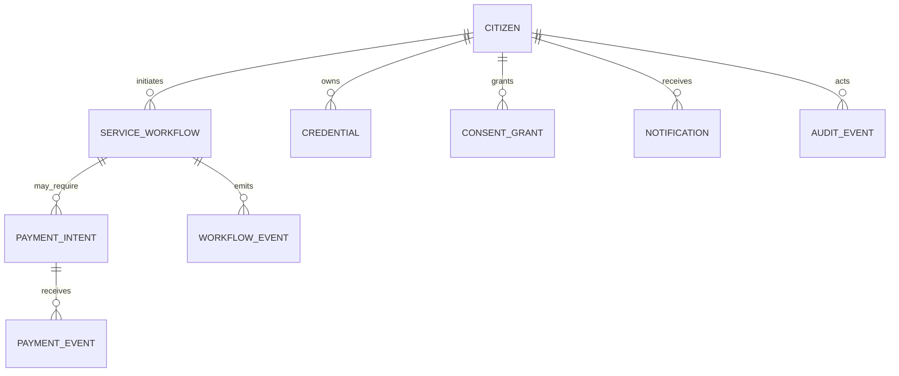

# CitizenOS Nepal — Core Domain Model

## 1. Design Rule
The database is not the product architecture. The core model separates identity, authorization, credentials, workflows, payments, external references, notifications and audit evidence.

## 2. Aggregate Overview

### Citizen Account
```text
CitizenAccount
- id
- identity_subject_id
- status
- preferred_language
- created_at
```

### Service Workflow
```text
ServiceWorkflow
- id
- citizen_id
- service_type
- status
- idempotency_key
- created_at
- updated_at
```

### Credential
```text
Credential
- id
- subject_id
- credential_type
- issuer_id
- status
- issued_at
- expires_at
- source_reference
- schema_version
```

### Consent Grant
```text
ConsentGrant
- id
- subject_id
- requester_id
- purpose_code
- resource_scope
- status
- granted_at
- expires_at
- revoked_at
```

### Payment
```text
PaymentIntent
- id
- citizen_id
- workflow_id
- obligation_id
- provider
- amount
- currency
- status
- idempotency_key
- provider_reference
```

### Audit Event
```text
AuditEvent
- id
- actor_type
- actor_id
- action
- resource_type
- resource_id
- purpose_code
- outcome
- correlation_id
- occurred_at
```

## 3. Relationship Model



## 4. Identifier Rules
- Use opaque internal UUID/ULID-style identifiers.
- Never use citizenship or national identity numbers as primary keys.
- Store external identifiers only in controlled fields with appropriate access policy.
- External references require source/issuer context.

## 5. Workflow Events
Workflow state changes are append-only events. The current state may be materialized for efficient reads, but important historical transitions remain auditable.

## 6. Data Classification
Every field introduced later must be classified as:
- PUBLIC
- INTERNAL
- PERSONAL
- SENSITIVE_PERSONAL
- HIGHLY_SENSITIVE

Classification drives logging, encryption, retention and authorization decisions.

## 7. Initial MVP Boundaries
The first executable model covers synthetic citizens, identity sessions, consent, credentials, transport workflows, insurance verification, payments, notifications and audit events. Health, tax, land and other domains remain outside the initial schema.
