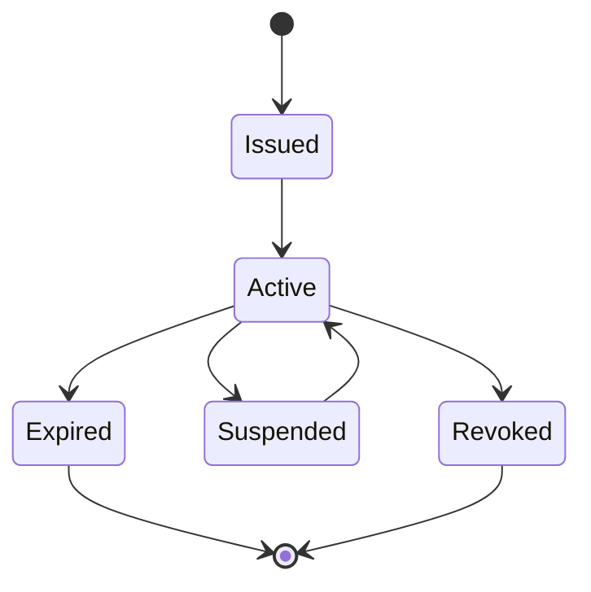

# CitizenOS Nepal — Digital Credential Model

## 1. Objective
The Digital Vault presents trustworthy credentials without treating uploaded files as authoritative government records.

## 2. Credential Classes
### Verified Credential
Issued or verified by a trusted/authorized issuer through a defined trust mechanism.

### User Attachment
A citizen-uploaded file. It may be useful evidence, but is not automatically verified.

### External Reference
A reference to an authoritative record that remains in an agency system.

### Portable Signed Credential
A cryptographically verifiable credential/presentation where the issuing ecosystem supports it.

The UI and API must never blur these classes.

## 3. Minimum Metadata
```text
credential_id
subject_id (opaque CitizenOS ID)
type
issuer_id
issuer_name
issuance_date
expiry_date (optional)
status: active|expired|revoked|suspended|unknown
verification_method
source_reference
schema_version
last_status_check
attributes/presentation claims (minimized)
```

## 4. Lifecycle


Status must come from an authoritative status mechanism where available. CitizenOS cannot locally 'unrevoke' an issuer-revoked credential.

## 5. QR Verification
QR verification should expose the minimum information required. Prefer a signed presentation or opaque verification reference over embedding full personal records in the QR.

A verifier should be able to determine:
- credential type
- trusted issuer
- validity/signature result
- expiry/status
- limited disclosed claims needed for the verification purpose

## 6. Selective Disclosure
Where technology and issuer support allow it, verification should answer questions such as `valid driving licence: yes/no` rather than exposing the citizen's complete transport record.

## 7. Sharing
Sharing requires:
- recipient/purpose visibility
- explicit attribute selection where practical
- expiration/one-time use for share links or presentations
- revocation where technically possible
- audit record

## 8. Storage
Do not store duplicate authoritative documents merely because storage is cheap. Store signed credentials, references, metadata or encrypted attachments according to the credential type and retention policy.

## 9. Verification Result
Never return only `valid: true`. Include provenance and reasoned status such as issuer trusted, signature valid, not expired, not revoked/status-known, and checked-at timestamp.

## 10. MVP
The MVP will use a local prototype issuer/trust registry and synthetic credentials for identity, transport and education. These credentials must be clearly labeled as demo data and must not imitate real official credentials closely enough to be mistaken for genuine government documents.
