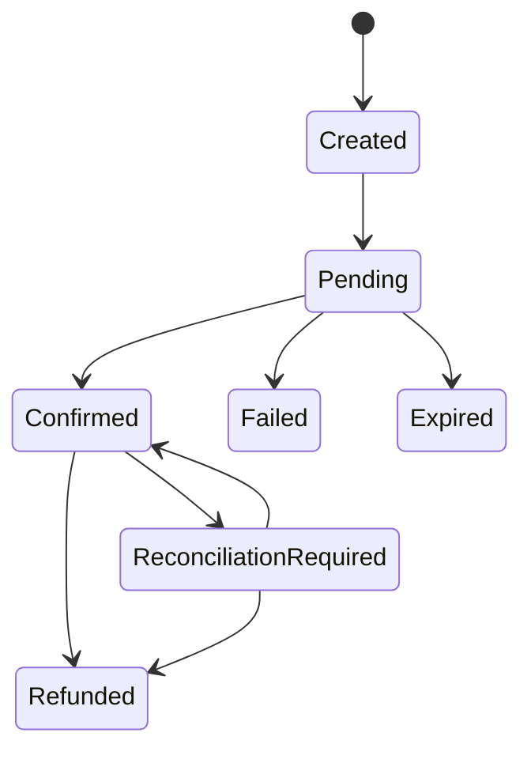
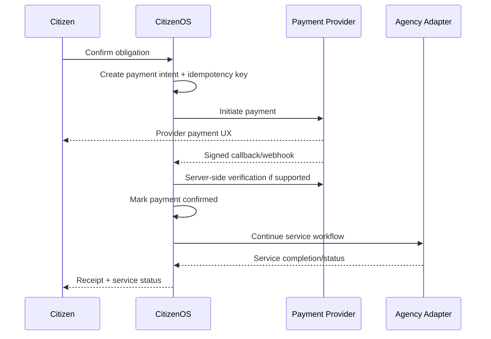

# CitizenOS Nepal — Payment Orchestration Architecture

## 1. Principle
CitizenOS is not a bank and the prototype is not a licensed wallet. It orchestrates payments through authorized/sandbox payment providers and links those transactions to government-service obligations.

The most important rule is:

> Payment success and government-service completion are different states.

## 2. Entities
- **Obligation:** amount the citizen owes for a service.
- **Payment Intent:** CitizenOS request to pay an obligation.
- **Provider Transaction:** transaction at the payment provider.
- **Service Workflow:** government process associated with the obligation.
- **Receipt:** evidence of confirmed payment/service references.
- **Reconciliation Case:** ambiguous or inconsistent transaction requiring resolution.

## 3. State Model


The associated government workflow may remain `AGENCY_PROCESSING` after payment becomes `CONFIRMED`.

## 4. Happy Path


## 5. Required Failure Cases
- citizen abandons provider flow
- provider says pending
- duplicate callback
- forged callback
- callback arrives before browser redirect
- browser says success but server has no confirmation
- payment confirmed but agency unavailable
- agency rejects after payment
- amount mismatch
- refund required
- reconciliation needed after timeout

## 6. Security
- TLS for all communication
- provider webhook signature/authentication verification
- server-side confirmation where provider contract supports it
- idempotency on initiation and processing
- strict amount/currency/reference validation
- secrets stored in secret manager/environment, never repository
- no storage of raw card credentials
- privileged refund/manual-adjustment actions audited

## 7. Data Model Direction
```text
payment_intent
- id
- citizen_id
- obligation_id
- workflow_id
- amount
- currency
- provider
- provider_reference
- status
- idempotency_key
- created_at
- confirmed_at

payment_event
- id
- payment_intent_id
- provider_event_id
- type
- verified
- received_at
- payload_hash/reference
```

Raw provider payload retention should be minimized and governed by policy.

## 8. Reconciliation
A scheduled reconciliation process checks unresolved transactions against provider status and workflow state. Manual resolution requires restricted roles, reason capture and audit logging.

## 9. MVP
Implement a `PaymentProviderAdapter` with a deterministic mock provider first. A real sandbox adapter can be added only with valid developer credentials and documented provider behavior.
