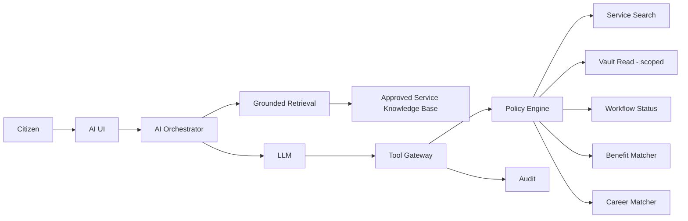

# CitizenOS Nepal — AI Citizen Assistant Architecture

## 1. Role
The AI Citizen Assistant is a navigation, explanation and recommendation layer. It is not a government authority and does not receive universal access to citizen records.

## 2. Allowed Capabilities
- explain supported government procedures from approved knowledge sources
- search the service catalogue
- identify required documents
- summarize records the current user is authorized to view
- explain credential/payment/workflow status
- create reminders with confirmation
- recommend potentially relevant benefits, training and jobs
- prepare forms/drafts using explicitly permitted data
- invoke narrowly scoped CitizenOS tools after policy checks

## 3. Prohibited Autonomy
The assistant must not independently:
- approve/reject licences, passports, welfare or other legal entitlements
- change authoritative government records
- waive fees/fines
- disclose another person's data
- infer legal eligibility when an authoritative rules engine/agency decision is required
- silently use unrelated academic, health, financial or identity data for recommendations

## 4. Architecture


## 5. Grounding
Procedural answers should retrieve from versioned, authoritative or approved service content. Retrieval results should retain source authority, publication/version date, jurisdiction and service identifier. When reliable information is unavailable, the assistant should say so rather than fabricate requirements.

## 6. Tool Security
Tool calls use structured schemas. The model proposes a call; a deterministic gateway validates it. Authorization is evaluated outside the model. High-impact actions require explicit user confirmation and may require step-up authentication or human approval.

Example:
```json
{
  "tool": "get_workflow_status",
  "arguments": {"workflow_id": "opaque-id"},
  "purpose": "answer citizen status question"
}
```

The gateway independently verifies that the authenticated citizen may access that workflow.

## 7. Prompt Injection Defense
Retrieved documents, uploaded documents and external content are untrusted data. Instructions inside them cannot alter authorization, reveal secrets, expand tool permissions or override system policy.

## 8. Career Recommendation
Career matching may use qualifications/skills only when the citizen enables that purpose. The system should expose why a recommendation appeared, allow the citizen to exclude attributes, avoid protected/sensitive attributes unless legally justified, and never represent a recommendation as a guaranteed job outcome.

A rules/features layer should produce interpretable match factors; the LLM may explain them but should not invent qualifications.

## 9. Benefit Discovery
Benefit discovery should distinguish:
- `potentially relevant` — recommendation based on known criteria;
- `pre-check passed` — deterministic published criteria appear satisfied;
- `officially eligible/approved` — only when returned by the responsible authority.

AI must never collapse these states.

## 10. Privacy
- minimize conversation retention
- separate analytics from raw sensitive content
- do not use citizen records for model training by default
- redact secrets/tokens
- enforce purpose-bound retrieval
- provide conversation deletion/retention controls according to policy

## 11. Evaluation
The AI release gate should test:
- grounded answer correctness
- citation/source correctness
- hallucination rate
- refusal/uncertainty behavior
- unauthorized tool-call prevention
- prompt injection resistance
- cross-user data isolation
- recommendation explainability
- Nepali and English quality
- latency and cost

For unauthorized tool execution, the acceptable target is zero successful unauthorized actions in the evaluation suite.

## 12. MVP
Start with a limited service knowledge base and read-only tools. Add mutating tools only after authorization, confirmation, audit and recovery behavior are tested.
